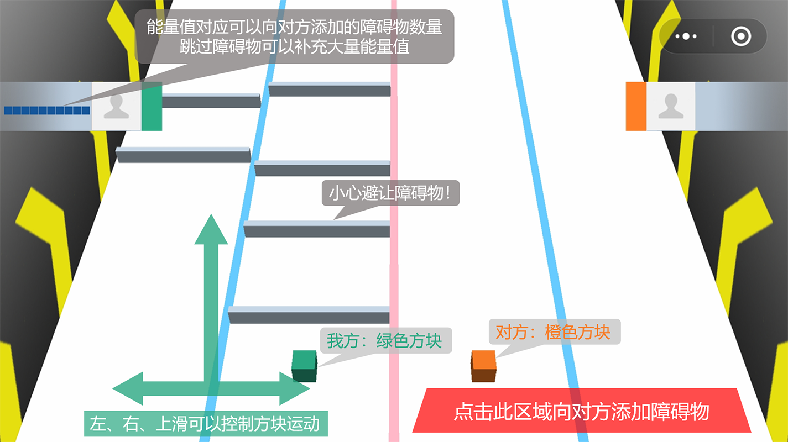

# “小心前方”微信小游戏文档

GitHub链接：https://github.com/CyrilKZ/FunnyGame

二维码：

## 游戏策划与功能
### 核心玩法

点击、上滑、左滑、右滑，涵盖了触屏手机的基本操作，也是本游戏的主要交互方式。两位玩家借助网络联机进行实时对战，通过滑动屏幕，操作己方方块运动来躲避前方障碍，通过点击屏幕上的特定位置，在对方方块的赛道上添加障碍。

双人对战、相互干扰的模式，给予了游戏比较高的开放度，也增添了游戏的娱乐性和竞技性，玩家可以利用多种策略来达到战胜对方的目的，这些玩法的组合大大丰富了游戏的可玩性。

滑动和点击两种操作通常要求两只手进行分工，考验玩家的反应能力和协调能力，需要在躲避己方障碍和向对方添加障碍这两种策略间进行平衡，做出抉择。

借助微信小游戏的社交接口，游戏实现了方便的邀请对战和易用的好友排行榜，在提升可玩性的同时增强了社交属性。

### 规则设计
#### 积分

#### 魔力值

### 游戏界面
游戏界面由首页、排行榜、帮助页面、组队界面、游戏主界面和结算界面组成。

首页

## 代码架构
### 前端

### 后端

## 游戏效果
e.g. 3D效果的渲染、沉浸式的动画特效等

## 游戏优化与效率
e.g. 解决网络延迟过大、网络socket断线重连等

## 外部库引用
### Three.js

### express + ws
express和ws是搭建后端服务器使用的主要第三方库，

## 分工情况

- 骆炳君：负责后端服务器、前端网络模块和开放数据域开发、参与前端UI设计
- 谭昊天：

