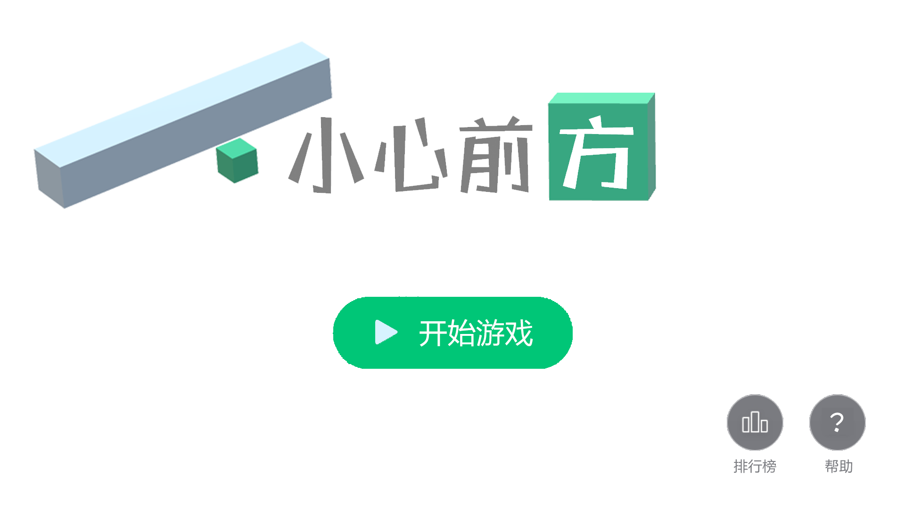

# “小心前方”微信小游戏文档

GitHub链接：https://github.com/CyrilKZ/FunnyGame

二维码：

测试环境：分辨率1920x1080

## 游戏亮点
- 双人对战模式的可玩性与社交性
- 开放式的游戏玩法与策略
- 3D模型、场景和动画效果

## 游戏策划与功能
### 核心玩法

点击、上滑、左滑、右滑，涵盖了触屏手机的基本操作，也是本游戏的主要交互方式。两位玩家借助网络联机进行实时对战，通过滑动屏幕，操作己方方块运动来躲避前方障碍，通过点击屏幕上的特定位置，在对方方块的赛道上添加障碍。

双人对战、相互干扰的模式，给予了游戏比较高的开放度，也增添了游戏的娱乐性和竞技性，玩家可以利用多种策略来达到战胜对方的目的，这些玩法的组合大大丰富了游戏的可玩性。

滑动和点击两种操作通常要求两只手分工，考验玩家的反应能力和协调能力，需要在躲避己方障碍和向对方添加障碍这两种策略间进行平衡，做出抉择。

借助微信小游戏的社交接口，游戏实现了方便的邀请对战和易用的好友排行榜，在提升可玩性的同时增强了社交属性。

### 规则设计
#### 积分

#### 魔力值

### 界面设计
游戏界面由首页、排行榜、帮助页面、组队界面、游戏主界面和结算界面组成。

首页由游戏Logo和3个按钮组成，点击“开始游戏”按钮进入组队界面后，玩家可通过微信转发接口将邀请组队信息发送给好友，此时位于画面右侧的正是本局游戏将要使用的赛道。

在双方都选择准备后，游戏的主镜头将切入赛道上方，并缓缓下降到游戏主界面的视角，主要的游戏场景将基于这个界面展开，两个玩家操控两个方块展开竞争，或躲避或跳跃前方的障碍物，其中一个方块一旦碰上障碍物，另一方就获得本局胜利。

对局结束后，游戏进入结算界面，该界面将显示谁是胜者以及双方的得分（只有胜者的积分会记入排行），轻触屏幕可以进入组队界面，开启下一局。

排行榜界面调用了微信开放数据域接口，展示了微信好友中积分前八名和玩家自己的排名信息，拓展了游戏的社交性。

## 游戏效果与优化
e.g. 3D效果的渲染、沉浸式的动画特效等

e.g. 解决网络延迟过大、网络socket断线重连等

## 技术实现
### 前端

### 后端
出于信息安全考虑，微信小游戏仅允许与后端服务器通过安全的https和wss协议进行通信。因此后端服务器的技术实现主要基于https和WebSocket（wss）两部分。

https基于http协议，请求过程也与普通http请求差不多，因此仅限于对实时性和动态性要求不高的请求，例如用户登录，加入房间等。WebSocket协议是建立在TCP协议上的一种网络通信协议，具有数据轻便、双向通信等特点，适合对实时性和可靠性要求都比较高的连接，因此被选择作为游戏场景中后端服务器与前端的主要通讯方式。

后端的入口文件为back/index.js，主要实现在server文件夹中的三个模块中，其中主模块index.js主要封装了Server类，整合了https和wss两种协议，实现了将网络请求发送到函数接口的功能，team.js模块主要封装了User类、Team类和userHandler、teamHandler，主要用于处理有关用户、组队过程中的数据和信息，scene.js模块主要封装了游戏过程中面向WebSocket的一些接口，主要负责辅助前端完成游戏逻辑和信息交互。

注：后端实现的所有接口可参见 https://github.com/CyrilKZ/FunnyGame/tree/master/back/README.md

## 外部库引用
### Three.js

### https + Express + ws 
微信小游戏主要通过https和WebSocket与服务器交换数据，所以搭建后端服务器主要采用https + Express + ws的架构。其中https基于http服务器模块，用于支持安全http协议，Express用于处理用户登录、创建及加入房间等API请求，ws则用于搭建WebSocket服务器。

ws是Node.js中用于WebSocket服务器的一个模块，基于ws模块搭建起后端服务器后，一个对局中的两名玩家分别与服务器建立WebSocket连接，交换游戏数据和队伍信息，取得了比较好的效果。

## 分工情况

- 骆炳君：负责后端服务器、前端网络模块和开放数据域开发、参与前端UI设计
- 谭昊天：

